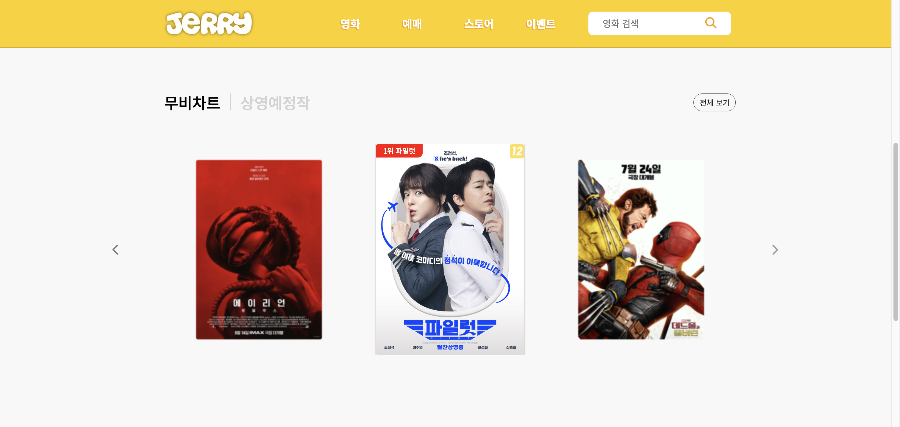
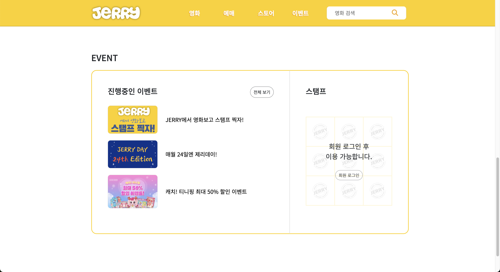
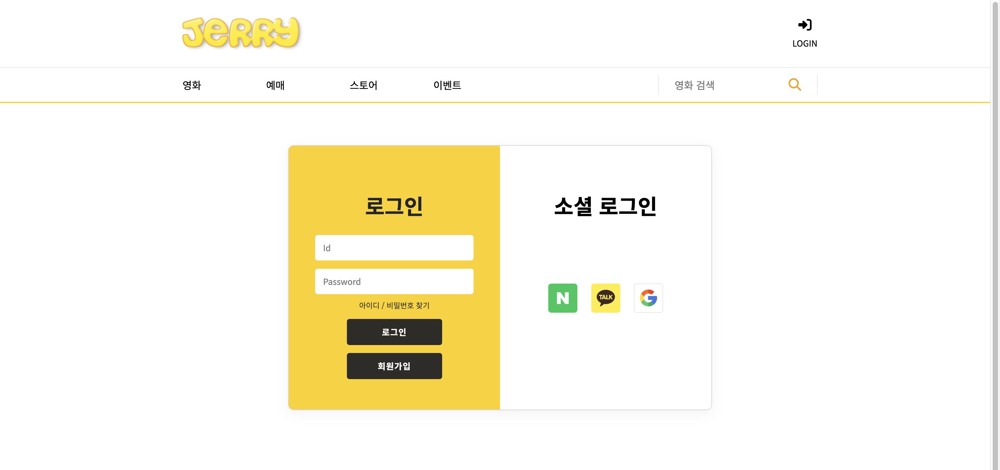
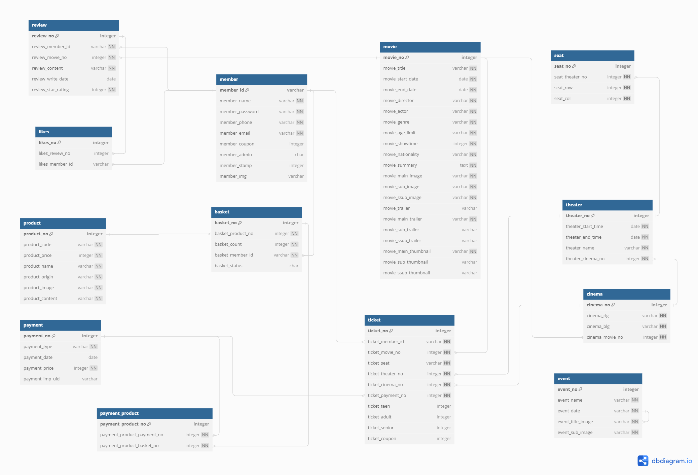

  
## 🧀 JERRY MOVIE _ 실시간 영화 예매 사이트
실시간 영화 예매 사이트

 

> Back-End Develop
>  
> 2024.07.24 ~ 2024.08.21

 

### ✏️ Summary

##### 친숙한 캐릭터의 이름으로 사용자가 친근하게 접근할 수 있는 실시간 영화 예매 사이트입니다.
##### 실시간 좌석 확인 및 예매 기능을 지원하고, 다양한 영화 정보와 리뷰를 제공함으로써 편리한 영화 예매가 가능합니다.
##### 자체 이벤트 진행으로 사용자들의 접근성을 높이고자 하였습니다.

 

### 🛠 ️Skills

-03C75A?style=flat-square&logo=naver&logoColor=white)

 

### 👩‍💻 My Role
#### 👤 인증 및 계정 관리
##### 1. 로그인
- 
##### 2. 소셜 로그인
- 
##### 3. 회원가입
- 
##### 4. 아이디 찾기 / 비밀번호 재설정
- 

#### 🖥️ Front-End
##### - 메인 페이지 UI

##### - 로그인 페이지 UI

 

### 📋 ERD

